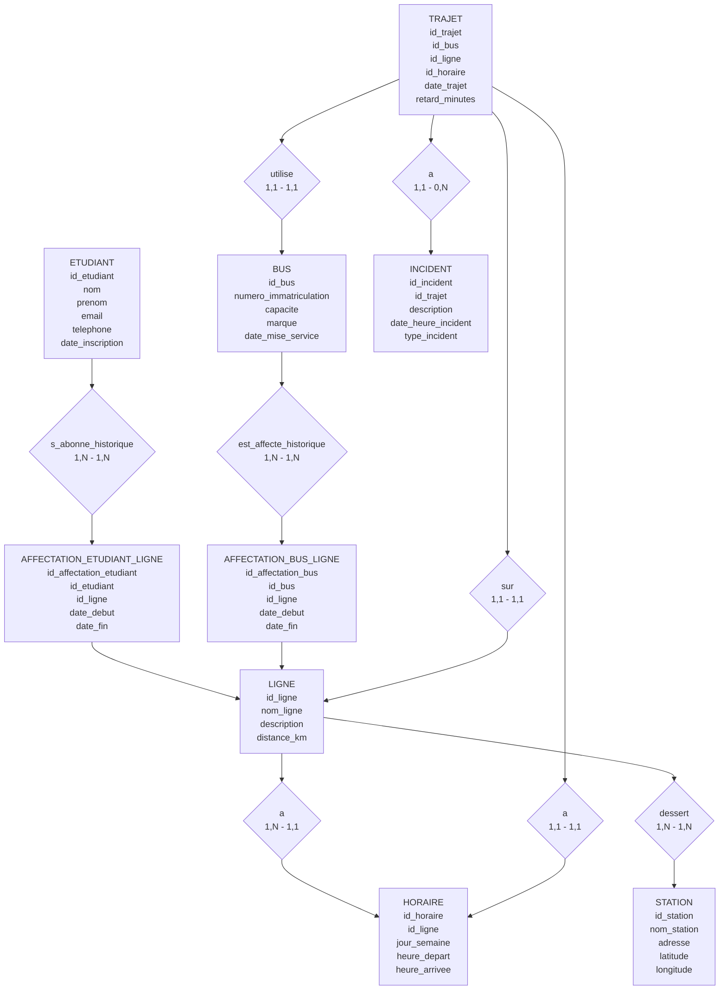

# Partie 2 : Modélisation Conceptuelle (MCD)

## Modèle Entité-Association

Le modèle conceptuel est représenté ci-dessous sous forme de diagramme ER (Entity-Relationship) utilisant Mermaid.

## Explication du modèle

- **ETUDIANT** : Représente les étudiants inscrits au système.
- **BUS** : Les véhicules de transport avec leur capacité.
- **LIGNE** : Les parcours de transport.
- **STATION** : Les arrêts sur les lignes.
- **HORAIRE** : Les plannings par ligne et jour.
- **AFFECTATION_ETUDIANT_LIGNE** : Historique des abonnements des étudiants aux lignes.
- **AFFECTATION_BUS_LIGNE** : Historique des affectations des bus aux lignes.
- **TRAJET** : Les passages effectifs des bus.
- **INCIDENT** : Les problèmes survenus lors des trajets.

Les cardinalités :
- Un étudiant peut avoir plusieurs affectations historiques, mais une seule active (date_fin NULL).
- Un bus peut avoir plusieurs affectations historiques.
- Une ligne a plusieurs horaires.
- Une ligne dessert plusieurs stations, une station sur plusieurs lignes (many-to-many).
- Un trajet utilise un bus, sur une ligne, à un horaire donné.
- Un trajet peut avoir plusieurs incidents.